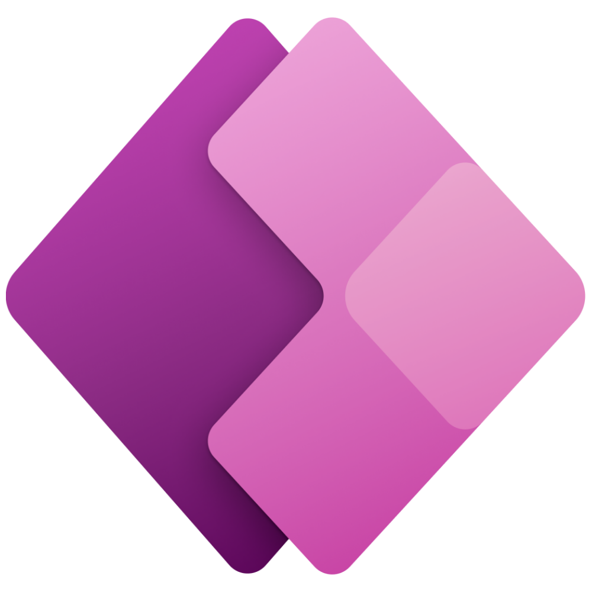
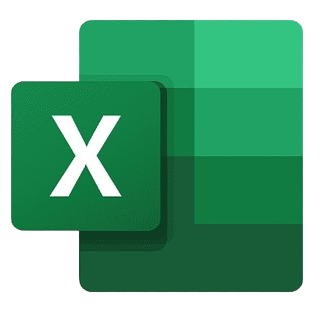
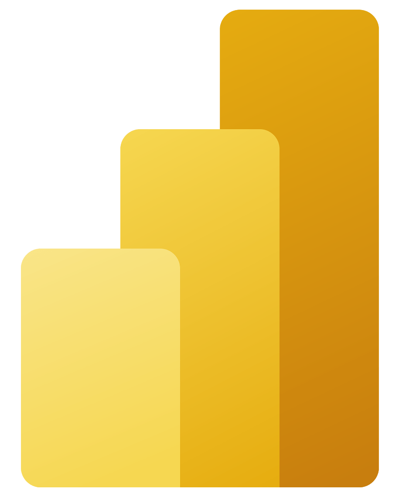

<!--horizontal divider (gradient)-->

<h1 align="center">
  
</h1>

  <h3>Full-stack developer junior. Construyo apps end-to-end: UI → lógica → datos → despliegue.</h3>
  
📍 Sevilla, España · 🎓 DAM · 🧩 Soporte IT + desarrollo (Python, Kotlin, C#) · 🤖 IA & automatización

<!-- CTA BUTTONS (table layout = spacing works in GitHub) -->

  <table cellpadding="0" cellspacing="0" border="0">
    <tr>
      <td align="center" border="0">
         
        
      </td>

  <td width="34"></td>
  <td align="center" border="0">
         
        
  </td>

  <td width="34"></td>
  <td align="center" border="0">
         
        
      </td>
  </tr>
  </table>

---

## Stack

<table width="100%" cellpadding="0" cellspacing="0" border="0">
  <tr>
    <td width="50%" valign="top" align="center">

  <h3>Web (Frontend)</h3>
  
    
  
  <h3>Backend / Scripting</h3>
  
    
  
  <h3>Bases de datos</h3>
  
    
  
  <h3>Tools</h3>
  
  
  </td>

<td width="50%" valign="top" align="center">

<h3>Mobile (Android)</h3>

  

<h3>Desktop (.NET)</h3>

  

<h3>Microsoft / Low-code / BI</h3>

&nbsp;&nbsp;&nbsp;

&nbsp;&nbsp;&nbsp;

&nbsp;&nbsp;&nbsp;

  </td>
  </tr>
</table>

---

## Proyectos destacados

### 🏥 WEB-DE-PROTOCOLOS-HSJD (TFG)
**Qué es:** app (TFG) para **gestionar y difundir protocolos hospitalarios** de forma centralizada, controlando visibilidad por **perfil/servicio** y registrando la **lectura** con **control de versiones**.

**Funciones y estructura**
- Catálogo filtrado por categoría/servicio/perfil.
- Trazabilidad: “pendiente / leído”.
- Versionado: si se publica una nueva versión, vuelve a aparecer como pendiente.
- Administración: alta/edición de protocolos y metadatos.

**Tech**  

&nbsp;

&nbsp;

🔗 Repositorio: https://github.com/SebiGitHub/WEB-DE-PROTOCOLOS-HSJD

---

### 📱 App Agenda (Android)
**Qué es:** app Android tipo agenda/contactos con **auth** y **almacenamiento en la nube** por usuario usando Firebase, con CRUD completo.

**Funciones y estructura**
- Registro / inicio de sesión.
- CRUD de contactos/entradas.
- Datos por usuario en la nube.
- Validaciones y feedback en UI.

**Tech**  

🔗 Repositorio: https://github.com/SebiGitHub/Agenda

---

### 🖥️ AvaloniaCatalogoWinForms
**Qué es:** app de escritorio en C# para gestionar un catálogo (listado + detalle), practicando estructura de UI y navegación con persistencia local.

**Funciones y estructura**
- Listado + detalle de ítems.
- Búsqueda/filtrado.
- CRUD (crear/editar/eliminar).
- Navegación y validaciones.

**Tech**  

&nbsp;

🔗 Repositorio: https://github.com/SebiGitHub/AvaloniaCatalogoWinForms

---

## Stats

  

<!--horizontal divider (gradient)-->

